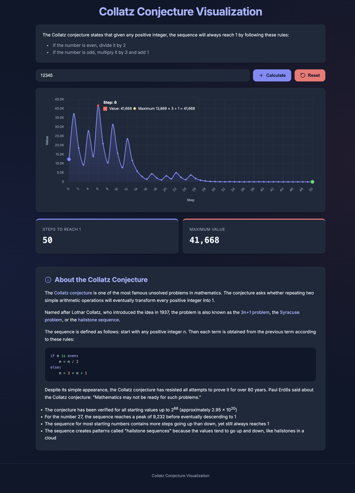

# Collatz Conjecture Visualization

A web-based visualization of the Collatz conjecture built with Go and JavaScript.

## The Collatz Conjecture

The Collatz conjecture is a mathematical conjecture concerning sequences defined as follows:

1. Start with any positive integer n.
2. If n is even, divide it by 2.
3. If n is odd, multiply it by 3 and add 1.
4. Repeat the process with the new value of n.

The conjecture states that no matter what positive integer we start with, the sequence will always reach 1.



## Features

- Interactive web-based visualization
- Line chart showing the progression of the sequence
- Statistics display (steps and maximum value)
- Reset button to clear the visualization

## Getting Started

### Prerequisites

- Go 1.16 or higher

### Running the Application

1. Clone this repository
2. Navigate to the project directory
3. Run the application:

```bash
go run main.go
```

4. Open your browser and navigate to `http://localhost:8080`

## Usage

1. Enter a positive integer in the input field
2. Click "Calculate" to visualize the Collatz sequence
3. Use the "Reset" button to clear the visualization and stats

## License

This project is licensed under the terms of the LICENSE file included in the repository.
